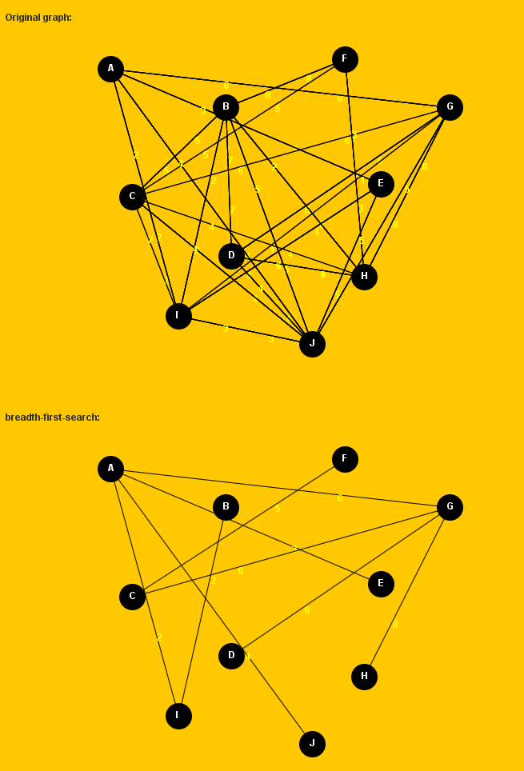
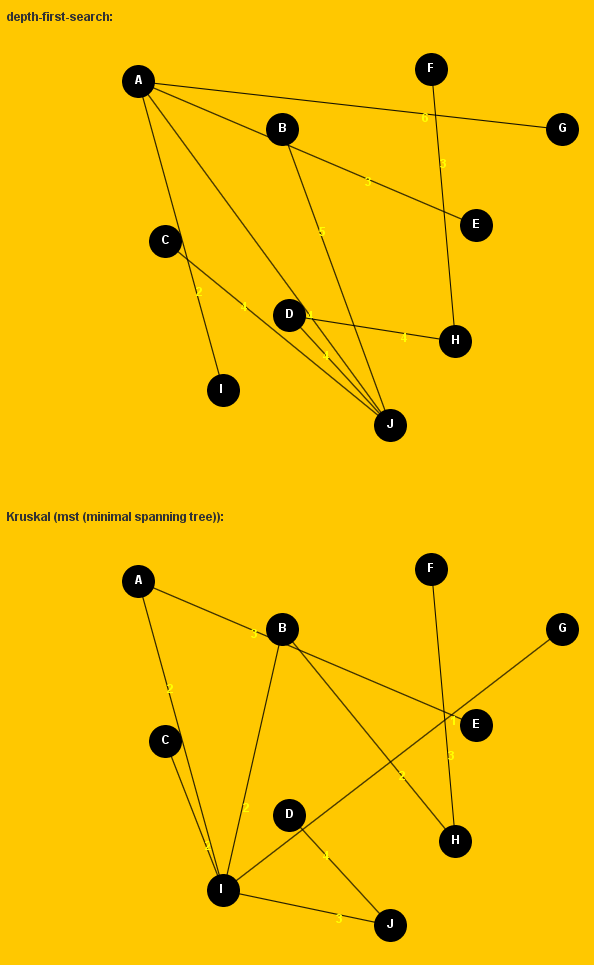
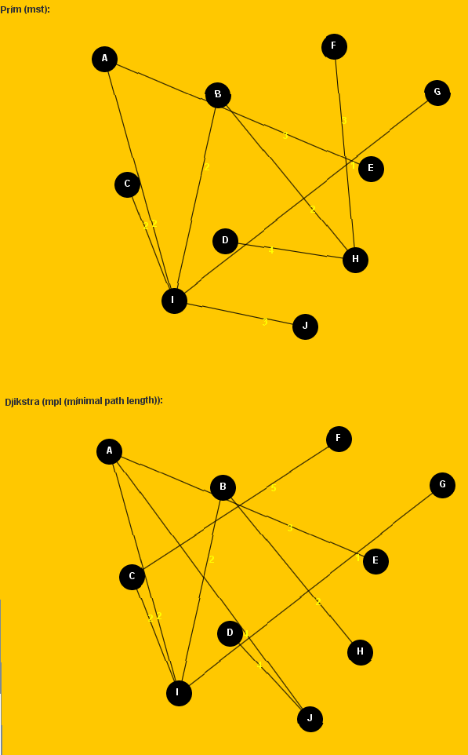
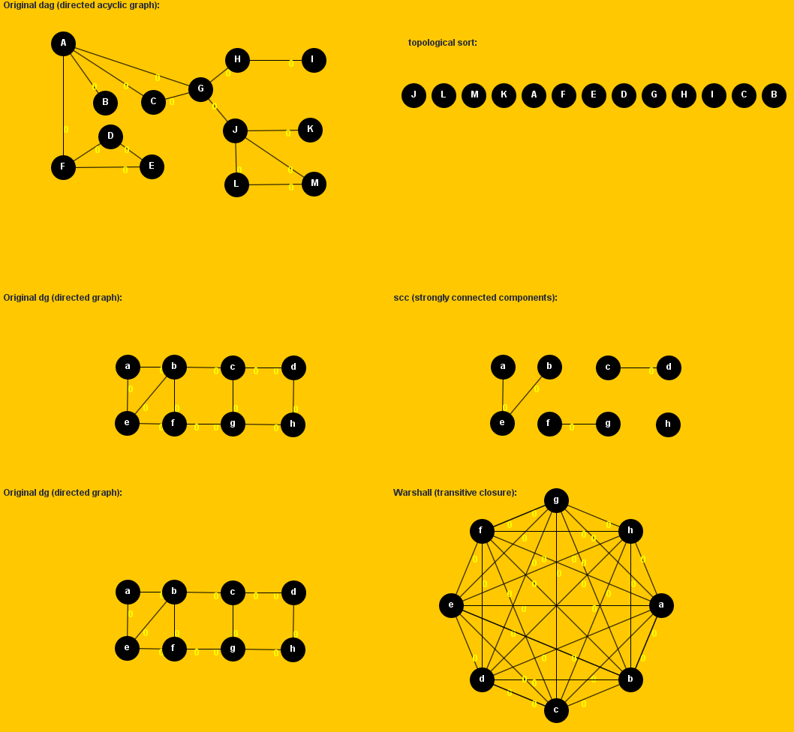
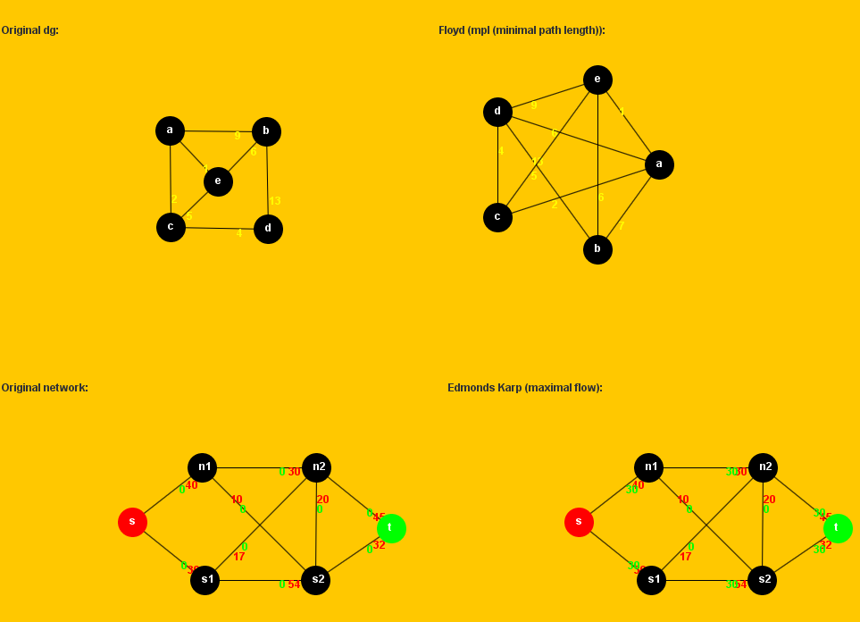

# Graph Theory Algorithms

Some graph theory algorithms and visualizations implemented in Java. The following algorithms are implemented:

- [breadth first search](https://en.wikipedia.org/wiki/Breadth-first_search), [depth first search](https://en.wikipedia.org/wiki/Depth-first_search)
- minimal spanning tree ([Kruskal]( https://en.wikipedia.org/wiki/Kruskal%27s_algorithm ), [Prim](https://en.wikipedia.org/wiki/Prim%27s_algorithm))
- minimal path length ([Djikstra](https://en.wikipedia.org/wiki/Dijkstra%27s_algorithm))
- [topological sort]( https://en.wikipedia.org/wiki/Topological_sorting) (for directed acyclic graph)
- [strongly connected components](https://en.wikipedia.org/wiki/Strongly_connected_component) (for directed graph)
- transitive closure (for directed graph, [Warshall](https://en.wikipedia.org/wiki/Floyd%E2%80%93Warshall_algorithm))
- minimal path length (for directed graph, [Floyd]( https://en.wikipedia.org/wiki/Floyd%E2%80%93Warshall_algorithm))
- maximal flow (for weighted graph, [Edmonds-Karp]( https://en.wikipedia.org/wiki/Edmonds%E2%80%93Karp_algorithm))

## Installation

Download the binary graph-algorithms-x-x-x.jar file from the releases. Make sure that Java JRE or JDK >= 1.7 is installed
In order to start the program, just double click the jar file in explorer (Windows).
If this doesn't work, try to start from the command line: `java -jar graph-algorithms-x-x-x.jar`
E.g. on windows: press windows key+r, type cmd -> `java -jar path to graph-algorithms-x-x-x.jar`

## Compilation and executable jar generation

If you want to feed the algorithms with different data, have a look at  `JAlgoApplet.java` and the data input files in `smsoftText`and `standardText`. Just modify data and code as you like. Afterwards recompile the Java code.

In order to generate a new own executable jar file, just compile the Java code and add the resulting class files together with all source code files into a zip file. Rename that zip file to jar. Done.
Hint: `.project` and `.classpath`files can be ignored. They are Eclipse IDE specific artifacts.

## Output Example

